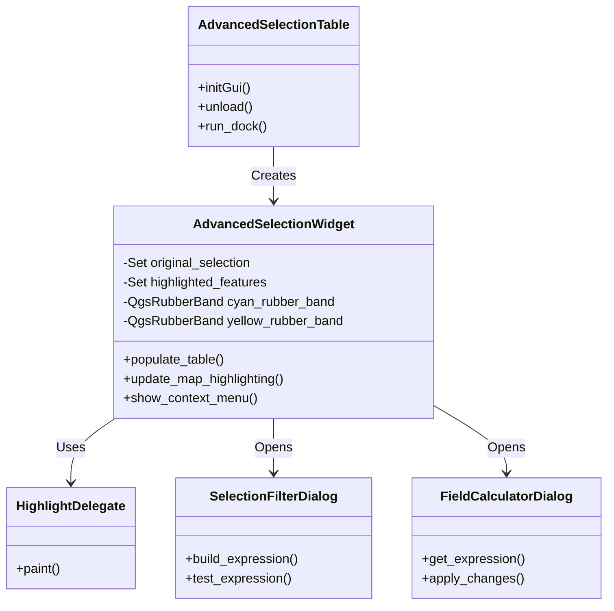
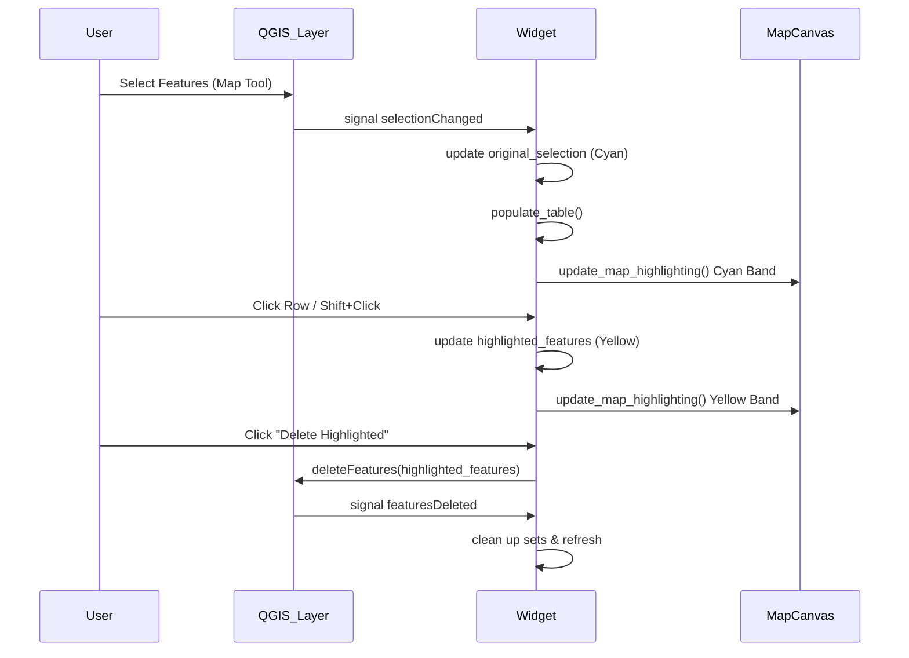

# Advanced Selection Table - Technical Documentation

> **Note**: This document is intended for the project Wiki. It serves as the primary Knowledge Transfer (KT) resource.

## 1. Executive Summary
The **Advanced Selection Table** Plugin extends QGIS functionality by introducing a **Dual-Selection Architecture**. Unlike the native attribute table which supports a single selection state, this plugin allows users to maintain a "Highlighted" subset within the "Selected" set, enabling granular data operations without losing the broader selection context.

### Core Capabilities
| Feature                  | Functionality                                                                     |
| :----------------------- | :-------------------------------------------------------------------------------- |
| **Dual Selection**       | Maintain `Original Selection` (Cyan) and `Active Subset` (Yellow) simultaneously. |
| **Visual Feedback**      | Real-time map synchronization using distinct rubber bands for context vs. target. |
| **Scoped Operations**    | Delete, Edit, or Calculate fields specifically on the `Active Subset`.            |
| **Contextual Filtering** | Query builder that only suggests values present in the current selection.         |

---

## 2. Technical Architecture

### 2.1 Class Diagram
The plugin follows a component-based architecture centered around the `AdvancedSelectionWidget`.



### 2.2 Data Flow & Synchronization
The system must keep three states in sync: **Layer Selection** (QGIS Core), **Table UI** (Plugin), and **Map Canvas** (Visuals).



---

## 3. Implementation Deep Dive

### 3.1 Two-Tier Selection Logic
*   **File**: `ui/selection_widget.py`
*   **Storage**:
    *   `self.original_selection`: `set` of FIDs. Represents the "Background" or "Context".
    *   `self.highlighted_features`: `set` of FIDs. Represents the "Foreground" or "Target".

**Critical Logic: Sorting Stability**
QGIS `QTableWidget` rows can be sorted visually, which desynchronizes row indices from data source indices.
*   **Problem**: Row 0 might visually be Feature A, but after sorting, Row 0 is Feature Z.
*   **Solution**: We embed the Feature ID (FID) into the QTableWidgetItem using `Qt.UserRole + 1`.
*   **Code**:
    ```python
    # Storing
    item.setData(Qt.UserRole + 1, fid)
    
    # Retrieving (Robust)
    def get_fid_for_row(self, row):
        item = self.table_widget.item(row, 0)
        return item.data(Qt.UserRole + 1)
    ```

### 3.2 Custom Rendering (The Delegate)
*   **File**: `ui/delegates.py`
*   **Role**: Overrides standard Qt drawing to prevent the OS default blue selection color from obscuring our custom Cyan/Yellow semantics.

**Key Algorithm**:
1.  Intercept `paint` event.
2.  **Strip** the `QStyle.State_Selected` flag from the style option.
3.  Check FID against `highlighted_features` → Draw **Yellow** background.
4.  Check FID against `original_selection` → Draw **Cyan** background.
5.  Call `super().paint()` to draw text content over the background.

### 3.3 Rubber Band Management
*   **Lifecycle**: Created on `init`, updated on signals, **destroyed on close**.
*   **Safety**: If rubber bands are not explicitly destroyed, they persist as "ghosts" on the canvas even after the plugin is disabled.
*   **Implementation**: `AdvancedSelectionTable.unload()` explicitly iterates all active docks and calls `cleanup_rubber_bands()`.

---

## 4. Feature Modules

### 4.1 Advanced Filter (`ui/filter_dialog.py`)
A context-aware expression builder.
*   **Optimization**: When opened, it iterates *only* the currently selected features to build a cache of unique values.
*   **UX**: This prevents the user from seeing irrelevant values (e.g., if filtering "California" features, it won't suggest "Paris" as a city value).

### 4.2 Scoped Field Calculator (`ui/calculator_dialog.py`)
*   **Targeting**: Automatically detects if a subset (Yellow) is active.
    *   If `len(highlighted) > 0`: Targets **Highlighted**.
    *   Else: Targets **All Selected**.
*   **Preview**: Updates in real-time by evaluating the QgsExpression against the first feature in the target set.

---

## 5. Development Guide

### 5.1 Project Structure
*   `advanced_selection_table.py`: Bootstrap.
*   `ui/`: Contains all logic.
    *   `selection_widget.py`: The "Brain".
    *   `delegates.py`: The "Look".
    *   `*_dialog.py`: The "Tools".

### 5.2 Adding a New Context Menu Action
1.  **Define Method**: Create a method in `AdvancedSelectionWidget` that performs the action (use `self.highlighted_features` to get FIDs).
2.  **Register**: In `show_context_menu(self, pos)`, add:
    ```python
    action = menu.addAction(QIcon(":/path.svg"), "Action Name")
    action.triggered.connect(self.my_new_method)
    ```

### 5.3 Troubleshooting
**Issue: Rows appear white/blank.**
*   *Cause*: The Delegate is failing to paint, or the `Qt.UserRole` data is missing.
*   *Fix*: Check `populate_table` ensures `setData` is called.

**Issue: Map highlights stick after closing.**
*   *Cause*: `cleanup_rubber_bands` wasn't called.
*   *Fix*: Ensure `closeEvent` or `unload` hooks are firing.

**Issue: "ArcGIS" trademark concerns.**
*   *Status*: **Clean**. All references have been removed. Ensure no new code re-introduces specific trademarked terms.
